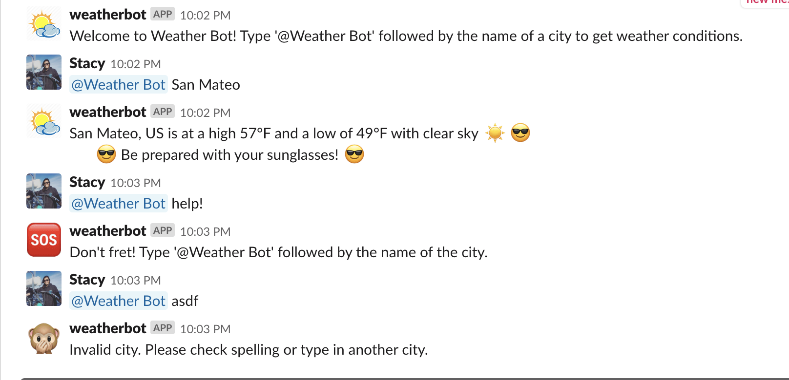

# @WeatherBot :sunny: :zap: :cloud:
A slack weather bot that reports the weather of a city of choice using the [OpenWeatherMap API](https://openweathermap.org/).

## Getting Started 
*This bot is hosted on [Heroku](https://www.heroku.com/), which may take a while for the response :hourglass: . Instructions for running this bot locally could be found below.*

1. If bot is active, type in the bot followed by the city name: **@Weather Bot (CITY-NAME)** 
  
    example: **@Weather Bot San Francisco**
    
2. The bot will report with the appropriate message. 

# 

### To run bot locally

1. Clone this repository. 
2. Install dependencies: `npm install`
3. Start running bot: `npm start`
4. Type in **@Weather Bot (CITY-NAME)** into a Slack channel with the city of choice.

### Built With:
- [Node.js](https://nodejs.org/en/)
- [Axios](https://github.com/axios/axios): Promise based HTTP client for the browser and node.js
- [Slackbots](https://www.npmjs.com/package/slackbots)

## Design/Architecture & Improvements

- **@Weather Bot** covers basic weather report to the user
    - High and Low temperature of the day and description of the weather
- Bot looks for key words in description of weather, such as `cloudy`, to determine emojis and messages to send back to user
    - Can be improved by making messages more descriptive after more familiarity/research of weather conditions (ex. humidity, pressure, wind, etc) at different places.
- Deployed using Heroku 
    - Can be faster with more dinos!

## License
This project is licensed under the MIT License.

## Acknowledgements and Resources
- [Build a Slackbot](https://www.youtube.com/watch?v=nyyXTIL3Hkw): Useful youtube video to help get me started
- [Learn How to Build Slack Bot Node.js](https://sabe.io/tutorials/learn-how-to-build-slack-bot-node-js): Blog with more details using node.js

